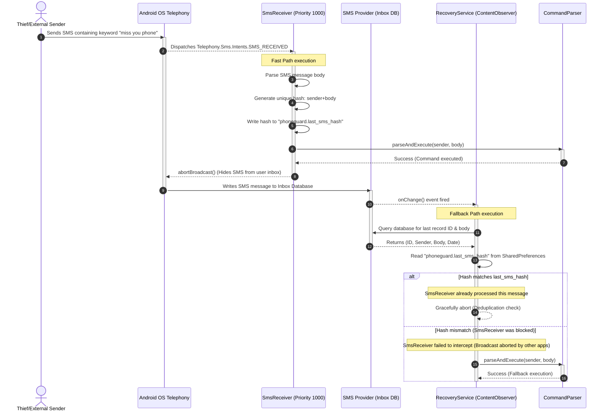
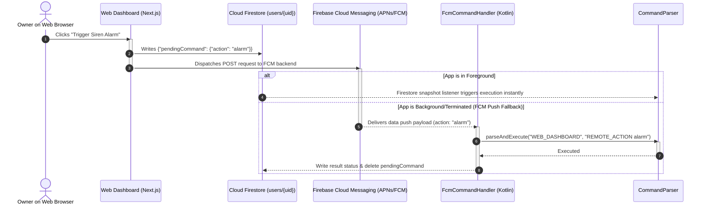
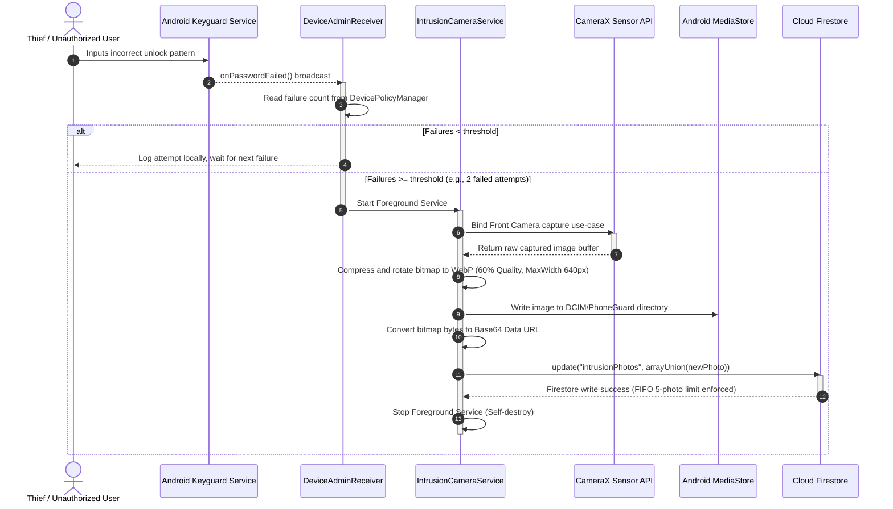
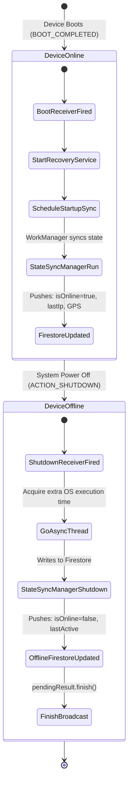

# 🏗️ PhoneGuard — Architectural Specification

This document details the software architecture, native integration layers, state synchronization mechanisms, and visual execution flows of the **PhoneGuard** anti-theft and recovery platform.

---

## 1. System Architecture Paradigm

PhoneGuard is designed around a **Decoupled Monolith + Event-Driven Cloud Synchronizer** architecture.

```
┌─────────────────────────────────────────────────────────────────┐
│                    Flutter Presentation layer                   │
│         [Screens] ➔ [Providers] ➔ [Repository Abstraction]       │
└────────────────────────────────┬────────────────────────────────┘
                                 │
                   Reads & Writes SharedPreferences
                                 │
┌────────────────────────────────▼────────────────────────────────┐
│                   Native Android Kotlin Layer                    │
│      [Services] ➔ [Broadcast Receivers] ➔ [Content Observers]    │
└─────────────────────────────────────────────────────────────────┘
```

1.  **Presentation Separation (Flutter/Dart)**: The user-facing dashboard, trusted contact selection, setup flows, and payment workflows are written in Dart. This layer depends on the `Provider` package to broadcast updates reactively.
2.  **Native Hardening (Kotlin/Android)**: Hardware-dependent functions—silent photo capture, high-priority SMS interceptors, SMS database observers, bypass-silent sirens, and SIM state receivers—are written natively in Kotlin. These components execute out-of-process or in low-level background threads without loading the Flutter engine.
3.  **Intermediate Synchronization Hub (SharedPrefs + Firestore)**: Communication between the decoupled presentation and native runtime layers is managed asynchronously. Configuration parameters are stored in a Shared SharedPreferences file (`FlutterSharedPreferences`), while remote commands and evidence files are synchronized via Cloud Firestore.

---

## 2. Flutter-Native Bridge: MethodChannel Spec

Dart calls Native Kotlin methods via a unidirectional binary messaging conduit called `MethodChannel`.

*   **Channel Name**: `lost_phone_finder/channel`
*   **Source Implementation**: [native_service.dart](file:///d:/Flutter%20Apps/phoneguard/lib/data/datasources/native_service.dart)
*   **Target Handler**: [MainActivity.kt](file:///d:/Flutter%20Apps/phoneguard/android/app/src/main/kotlin/com/kyvronix/phoneguard/MainActivity.kt)

### Method Dictionary

| Method Identifier | Arguments | Return Type | Android API Utilized |
| :--- | :--- | :--- | :--- |
| `startAlarm` | None | `Boolean` | `MediaPlayer` via `AlarmService` |
| `stopAlarm` | None | `Boolean` | `MediaPlayer.release()` |
| `requestDeviceAdmin` | None | `Boolean` | `DevicePolicyManager.ACTION_ADD_DEVICE_ADMIN` |
| `deactivateDeviceAdmin`| None | `Boolean` | `DevicePolicyManager.removeActiveAdmin` |
| `isDeviceAdminActive` | None | `Boolean` | `DevicePolicyManager.isAdminActive` |
| `lockDevice` | None | `Boolean` | `DevicePolicyManager.lockNow` |
| `startTrackingService` | `targetNumber: String` | `Boolean` | `FusedLocationProviderClient` |
| `stopTrackingService` | None | `Boolean` | `Service.stopSelf()` |
| `sendSms` | `to: String`, `message: String` | `Boolean` | `SmsManager.sendTextMessage` |
| `captureIntruderPhoto` | None | `Boolean` | CameraX `ImageCapture` in background service |
| `startRecoveryService` | None | `Boolean` | Registers `ContentObserver` on SMS database |
| `startFirestoreCommandService` | None | `Boolean` | Listen to live document snapshots |

---

## 3. Native Background Architecture

Kotlin services execute background actions under strict operating system resource rules.

### Core Android Services

1.  **`RecoveryService`**: 
    *   **Priority**: High (`START_STICKY`).
    *   **Responsibility**: Coordinates background observers. It initializes on device boot (`BootReceiver`) and registers an inbox-level `ContentObserver` that monitors new messages.
2.  **`FirestoreCommandService`**:
    *   **Priority**: Foreground (`FOREGROUND_SERVICE_TYPE_SPECIAL_USE` on API 34+).
    *   **Responsibility**: Subscribes to document snapshot streams on Firestore under the `users/{UID}` collection to process commands issued from the web dashboard.
3.  **`TrackingService`**:
    *   **Priority**: Foreground (`FOREGROUND_SERVICE_TYPE_LOCATION`).
    *   **Responsibility**: Runs a high-priority timer that requests location coordinates every 3 minutes, translating them to Google Maps links and sending them back to the registered trusted sender via SMS.
4.  **`IntrusionCameraService`**:
    *   **Priority**: Foreground (`FOREGROUND_SERVICE_TYPE_CAMERA`).
    *   **Responsibility**: Uses Android CameraX to bind the front camera sensor to a silent image capture pipeline, saving the resulting photo into the gallery and uploading the Base64 representation to Firestore.

### Broadcast Receivers

*   **`BootReceiver`**: Catches `ACTION_BOOT_COMPLETED` and `ACTION_LOCKED_BOOT_COMPLETED` to launch the `RecoveryService` instantly before the lock screen is unlocked.
*   **`ShutdownReceiver`**: Catches `ACTION_SHUTDOWN` and quick-power-off events. It uses `goAsync()` to obtain extra thread cycles from the OS to sync a `SHUTDOWN` event alongside coordinates to Firestore.
*   **`SimChangeReceiver`**: Listens to `SIM_STATE_CHANGED`. When a SIM is fully loaded, it reads the current phone number, compares it to the cache, and alerts trusted numbers via SMS if a swap is detected.
*   **`DeviceAdminReceiver`**: Intercepts `onPasswordFailed` broadcasts. If the threshold count of failures is reached, it fires the `IntrusionCameraService`.

---

## 4. Visual Process Workflows

### A. Dual-Layer SMS Detection Sequence
This mechanism ensures command delivery even if the default SMS messaging app blocks standard broadcasts.



---

### B. Web Dashboard to Device FCM Command Pipeline
Real-time execution issued from a distance with battery-friendly notifications.



---

### C. Stealth Intruder Selfie Capture Pipeline
Monitors unlock failures and securely syncs the visual evidence package to the cloud.



---

### D. Boot/Shutdown Lifecycle State Synchronization
Maintains device presence mapping in the database.


