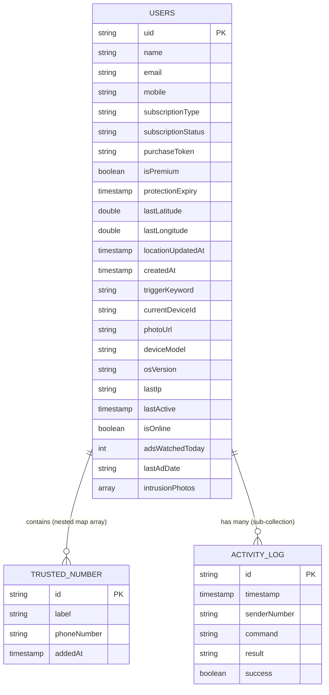

# 🗄️ PhoneGuard — Database & Data Synchronizations

This document details the local data caching strategies, shared cross-process variables, and cloud-based schema definitions utilized in PhoneGuard.

---

## 1. Storage Architecture Overview

PhoneGuard implements a hybrid local-cloud persistence layout designed to maintain operations when offline:

```
┌────────────────────────────────────────────────────────┐
│                      Mobile UI                         │
│   Uses Hive boxes (Settings & Logs) for speed          │
└────────┬──────────────────────────────────────┬────────┘
         │ Writes Settings                      │ Writes Logs
         ▼                                      ▼
┌────────┴────────┐                    ┌────────┴────────┐
│ SharedPreferences                    │ SharedPreferences
│ (app_settings)  │                    │ (activity_logs) │
└────────┬────────┘                    └────────▲────────┘
         │ Reads config                         │ Appends logs
         ▼                                      │
┌────────┴──────────────────────────────────────┴────────┐
│                Native Background Services              │
│   (SmsReceiver, RecoveryService, StateSyncManager)    │
└────────────────────────┬───────────────────────────────┘
                         │
                  Synchronizes State via WebSockets/REST
                         ▼
┌────────────────────────────────────────────────────────┐
│                    Cloud Firestore                     │
│   Maintains user documents, metadata & intrusion info  │
└────────────────────────────────────────────────────────┘
```

---

## 2. Local Persistence Layers

### A. Hive Data Cache
Used primarily by the Flutter UI layer for fast, object-based storage.

*   **Box Name**: `settings_box`
    *   **Keys**: `app_settings` (Serialized JSON representing user rules, keywords, and trusted numbers).
*   **Box Name**: `logs_box`
    *   **Keys**: `activity_logs` (Serialized list of execution logs).

### B. SharedPreferences (Cross-Process Synchronization Bridge)
Because Android background services run in native processes independent of the Flutter Dart VM, configuration data and activity logs must be shared using Android's native `SharedPreferences` database.

*   **File Identifier**: `FlutterSharedPreferences`
*   **Access Mode**: `Context.MODE_PRIVATE`

#### Key-Value Directory

| Key Name | Data Type | Source Layer | Consumer Layer | Purpose |
| :--- | :--- | :--- | :--- | :--- |
| `flutter.app_settings` | `String` (JSON) | Flutter Settings UI | Native CommandParser | Contains SMS keyword triggers, whitelisted trusted numbers, and default actions (siren, tracking). |
| `flutter.activity_logs` | `String` (JSON Array) | Flutter Logs UI / Native services | Both Layers | Chronological logs of commands processed. Append-only by native layer, read/clear by UI layer. |
| `flutter.user_uid` | `String` | Flutter Auth Provider | Native StateSyncManager | Tracks current user UID to sync device coordinates to the correct database document. |
| `flutter.is_premium` | `Boolean` | Flutter Auth Provider | Native CommandParser | Gates command processing. If false, active subscription is required. |
| `flutter.protection_expiry`| `String` (ISO 8601) | Flutter Auth Provider | Native CommandParser | Gates command execution if user is utilizing ad-extended protection. |
| `flutter.created_at` | `String` (ISO 8601) | Flutter Auth Provider | Native CommandParser | Evaluates 3-day free trial eligibility. |
| `flutter.lastSimNumber` | `String` | Native SIM Receiver | Native SIM Receiver | Compares current IMSI on boot/SIM state changes to detect swap events. |
| `phoneguard.last_sms_hash` | `String` | Native SmsReceiver | Native RecoveryService | Holds the hash of the last parsed SMS to prevent duplicate processing by the `ContentObserver`. |

*Note: Device Protected SharedPreferences (`InternalPhoneGuardPrefs`) are utilized to hold the last processed SMS ID (`phoneguard.last_sms_id`) to ensure it persists and remains readable while the device is in Direct Boot mode (locked state before first system unlock).*

---

## 3. Cloud Database (Cloud Firestore Schema)

The master data definitions are hosted on Google Cloud Firestore.

### Entity Relationship Model



### Table & Fields Definitions

#### Collection: `users`
Each user is mapped to a document identifier matching their Firebase Auth UID (`users/{uid}`).

| Field Key | Data Type | Constraint rules | Description |
| :--- | :--- | :--- | :--- |
| `name` | `String` | Not null | User display name. |
| `email` | `String` | Unique, Valid email format | User account email. |
| `mobile` | `String` | E.164 formatted number | User primary mobile number. |
| `isPremium` | `Boolean` | Default: `false` | Subscription entitlement status. |
| `protectionExpiry` | `Timestamp` | Nullable | Expiry date of the protection license. |
| `intrusionPhotos` | `Array (Map)` | Maximum length: 5 | List of captured intruder pictures in JSON maps containing `url` (Base64), `timestamp`, `latitude`, and `longitude`. |
| `trustedNumbers` | `Array (Map)` | Map structure | List of contact numbers whitelisted to run SMS commands. |

#### Sub-Collection: `users/{uid}/activity_logs`
Logs of security commands executed on the client device.

| Field Key | Data Type | Constraint rules | Description |
| :--- | :--- | :--- | :--- |
| `id` | `String` | Primary Key | Unique UUID. |
| `timestamp` | `Timestamp` | Not null | Server time of execution. |
| `senderNumber` | `String` | Valid sender identifier | Origin of the command (`WEB_DASHBOARD` or SMS sender). |
| `command` | `String` | Valid command name | Identifier of the command (alarm, stop, lock, etc.). |
| `result` | `String` | Detailed text | Explanation of the outcome of execution. |
| `success` | `Boolean` | Default: `true` | Success status of the operation. |

---

## 4. Query & Memory Optimization

1.  **Index Optimization**: Firestore creates single-field indexes automatically. An index is configured on `timestamp` descending in the `activity_logs` sub-collection to ensure fast queries on large logs.
2.  **Size Limits (Intruder Photos)**: Firestore documents are limited to 1MB. Since intruder photos are saved directly inside the user document as Base64 WebP URLs, a FIFO (First-In, First-Out) size controller is implemented on the device to keep only the 5 most recent pictures, preventing document bloat.
3.  **Local Memory Optimization**: SharedPreferences and Hive logs are trimmed on the device to a maximum of 200 entries to prevent memory exhaustion on long-running installations.
