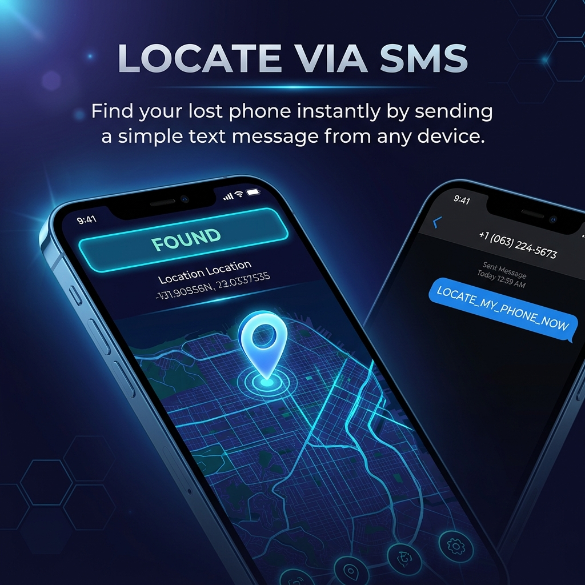
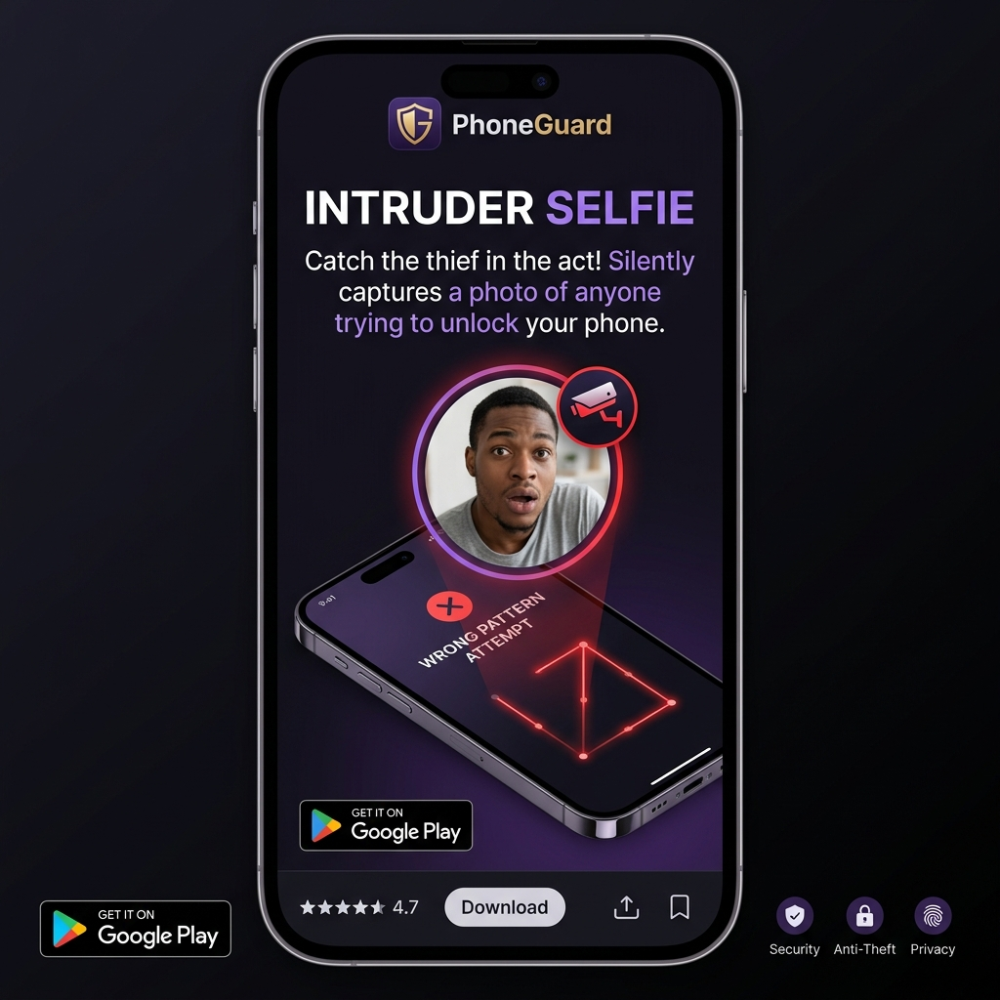
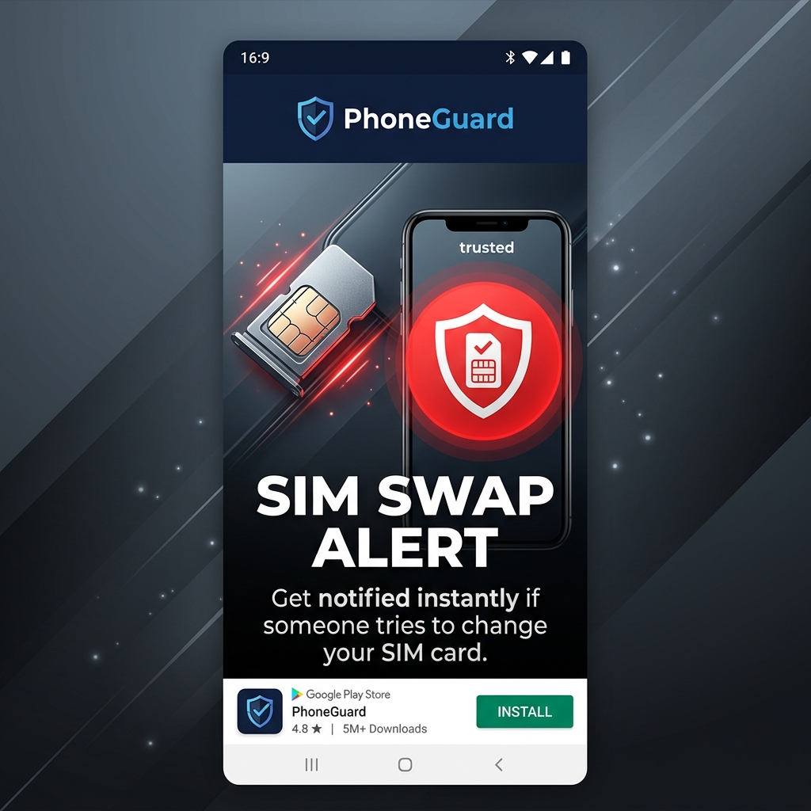
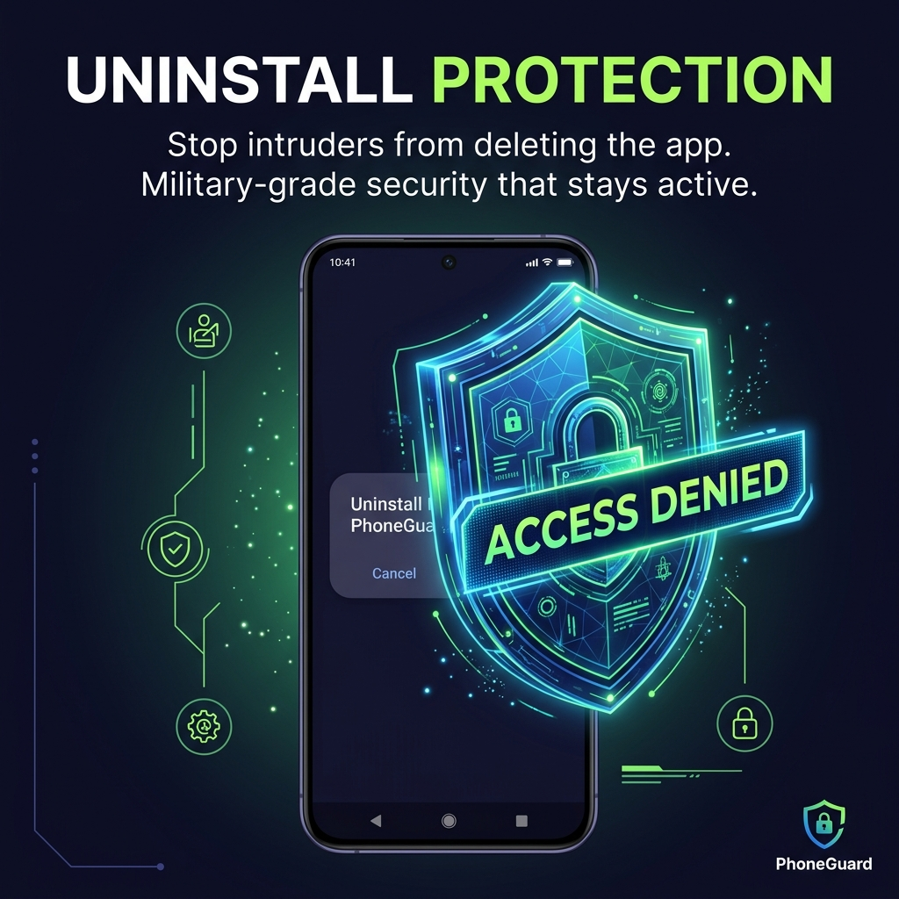

# 🛡️ PhoneGuard — Anti-Theft & Remote Recovery Suite

**PhoneGuard** is a professional-grade Android security application built with Flutter and native Kotlin. It protects your device against theft and gives you complete remote control over it via SMS — even when the app is closed, the phone is restarting, or the thief has turned off GPS.

---

## 🖼️ Visual Experience (Premium Features)

<p align="center">
  
  
  
  
</p>
<p align="center">
  
  
  
  
</p>

---

## 📋 Table of Contents
- [Visual Experience](#-visual-experience-premium-features)
- [Core Features](#-core-features)
- [Intrusion Detection System](#-intrusion-detection-system-ids)
- [SMS Remote Control](#-sms-remote-control--command-system)
- [Smart Location Tracking](#-smart-location-tracking--3-tier-gps-fallback)
- [Native Background Security](#-native-background-security)
- [Trusted Number Management](#-trusted-number-management)
- [Protection & Subscription System](#-protection--subscription-system)
- [Intelligent Growth Engine](#-intelligent-growth-engine)
- [Device Security](#-device-security)
- [Dashboard & Activity Logs](#-dashboard--activity-logs)
- [Architecture](#-architecture)
- [Setup & Installation](#-setup--installation)

---

## 🚀 Core Features

| Feature | Description |
|---------|-------------|
| 📸 Intrusion Detection | Captures silent front-camera selfie on wrong PIN/Pattern entry |
| 📩 SMS Remote Control | Trigger recovery actions from any phone via secret keyword |
| 📍 3-Tier GPS Fallback | Location works even with GPS turned off |
| 🔔 Remote Alarm | Bypass-silent loud alarm triggered via SMS |
| 🛰️ Live Tracking | Continuous real-time GPS updates via SMS |
| 🔒 Remote Lock | Lock device via SMS using Device Admin API |
| 🔄 Boot Sync | Auto-syncs device state to cloud on every power-on |
| 💀 Shutdown Sync | Captures final location and IP before power-off |
| 🌐 Dashboard | Real-time cloud dashboard showing device status |
| 👥 Trusted Contacts | Whitelist contacts from phonebook or manual entry |
| 🎯 SIM Change Alert | Instant SMS alert when SIM card is swapped |
| 📄 Legal Reports | Automated security incident reports for legal action |

---

## 📸 Intrusion Detection System (IDS)

PhoneGuard doesn't just find your phone; it identifies the thief.

### Silent Selfie Capture
- **Trigger**: Automatically activates front-facing camera after a user-defined number of failed unlock attempts (default: 3).
- **Silent & Stealthy**: No camera animation or shutter sound on the device.
- **Offline-First Sync**: Even without internet, the app saves the intruder's photo locally. As soon as the device connects to any network, the photo is automatically uploaded to your dashboard.

### 🛠️ Technical Deep-Dive: Stealth Camera Capture
The app uses a hidden native `TextureView` in a background service to silently capture the intruder without launching the UI.

```kotlin
// security/IntrusionCameraService.kt
private fun takeSilentPhoto() {
    val manager = getSystemService(CAMERA_SERVICE) as CameraManager
    manager.openCamera(frontCameraId, object : CameraDevice.StateCallback() {
        override fun onOpened(camera: CameraDevice) {
            val captureRequest = camera.createCaptureRequest(CameraDevice.TEMPLATE_STILL_CAPTURE)
            captureRequest.addTarget(imageReader.surface)
            cameraSession.capture(captureRequest.build(), null, null)
        }
    }, null)
}
```

### Evidence & Gallery
- **Large Gallery View**: View intruder selfies in high definition on both the mobile app (with pinch-to-zoom) and the web dashboard.
- **Location Metadata**: Every photo is tagged with the exact GPS coordinates and network IP at the time of the capture.
- **Direct Download**: Save high-res intruder photos directly to your computer or phone.

### 📄 Legal Action Readiness
- **Automated Incident Reports**: Generate professional-grade security reports (PDF-ready) on the web dashboard.
- **Evidence Package**: Reports include date/time stamps, GPS location, device owner info, and the visual evidence — perfect for filing police reports or legal claims.

---

## 📩 SMS Remote Control & Command System

PhoneGuard listens for SMS commands **silently** in the background without any visible notification. All commands use a customizable trigger keyword.

### Command Format
```
<trigger_keyword> [action]
```

### Examples
| SMS Sent | Result |
|----------|--------|
| `miss you phone` | Executes all default actions (location + alarm + tracking + lock) |
| `miss you phone location` | Sends current GPS location link |
| `miss you phone alarm` | Starts loud bypass-silent alarm |
| `miss you phone stop` | Stops alarm and tracking |
| `miss you phone lock` | Remotely locks the device |
| `miss you phone tracking` | Starts live location tracking |


### Security Layers
- ✅ Only **Trusted Numbers** can trigger commands
- ✅ **Protection eligibility check** before every command (trial / ad / subscription)
- ✅ **Dual-layer SMS detection** — works even when a messaging app is open and intercepts the broadcast

### Dual-Layer Detection (Bypass Proof)
PhoneGuard uses **two independent systems** to detect incoming trigger messages:

1. **`SmsReceiver` (Priority 1000)** — Standard Android broadcast receiver registered at maximum priority, fires first before any other app.
2. **`ContentObserver` on `content://sms/inbox`** — Watches the SMS database directly at OS level. **Cannot be blocked by `abortBroadcast()`** from messaging apps. Activates automatically when the user has a chat open in their messaging app.

### 🛠️ Technical Deep-Dive: Stealth SMS Interception
We use a maximum priority receiver to intercept commands before they hit the user's inbox, hiding them from the thief.

```kotlin
// sms/SmsReceiver.kt
@Receiver(priority = 1000)
override fun onReceive(context: Context, intent: Intent) {
    val messages = Telephony.Sms.Intents.getMessagesFromIntent(intent)
    for (msg in messages) {
        if (msg.messageBody.contains(triggerKeyword)) {
            abortBroadcast() // Intercepts and hides the SMS from the default messaging app!
            executeSecureCommand(msg.originatingAddress, msg.messageBody)
        }
    }
}
```

---

## 📍 Smart Location Tracking — 3-Tier GPS Fallback

This is PhoneGuard's most important anti-theft feature. Most phone trackers fail when a thief turns off GPS. **PhoneGuard does not.**

### How It Works

When a location is requested (via SMS trigger, on startup, or on shutdown), PhoneGuard tries **three methods in sequence**:

```
┌─────────────────────────────────────────────────────┐
│  Tier 1: High-Accuracy GPS (10s timeout)            │
│  • Most precise (1–10 metre accuracy)               │
│  • Requires GPS to be ON                            │
│  • Label: "📍 Location: <Google Maps link>"         │
└───────────────────────┬─────────────────────────────┘
                        │ GPS off or timed out?
                        ▼
┌─────────────────────────────────────────────────────┐
│  Tier 2: Network Location / Cell Towers (8s timeout)│
│  • Uses Wi-Fi networks + mobile cell towers         │
│  • Works WITHOUT GPS (50–200 metre accuracy)        │
│  • Label: "📍Approx. Location (GPS off): <link>"   │
└───────────────────────┬─────────────────────────────┘
                        │ No network? Still failing?
                        ▼
┌─────────────────────────────────────────────────────┐
│  Tier 3: Last Known Location (instant)              │
│  • Uses the last position cached by the Android OS  │
│  • Always available, may be minutes/hours old       │
│  • Label: "📍Approx. Location (GPS off): <link>"   │
└───────────────────────┬─────────────────────────────┘
                        │ Nothing at all?
                        ▼
┌─────────────────────────────────────────────────────┐
│  Final: "📍 Location unavailable — GPS & Network   │
│          both off"                                  │
└─────────────────────────────────────────────────────┘
```

### 🛠️ Technical Deep-Dive: Location Fallback Logic
This recursive strategy ensures a location is always retrieved, degrading gracefully if hardware sensors fail.

```kotlin
// location/LocationManager.kt
fun getBestLocation(context: Context) {
    // Tier 1: High Accuracy GPS
    requestLocation(Priority.PRIORITY_HIGH_ACCURACY, timeout = 10s) { location ->
        if (location != null) return@requestLocation sendSms(location)
        
        // Tier 2: Network / Cell Tower Fallback
        requestLocation(Priority.PRIORITY_BALANCED_POWER_ACCURACY, timeout = 8s) { netLoc ->
            if (netLoc != null) return@requestLocation sendSms(netLoc)
            
            // Tier 3: OS Last Known Cache
            val lastKnown = fusedLocationClient.lastLocation
            sendSms(lastKnown ?: "Location Unavailable")
        }
    }
}
```

### When Location is Sent
- **On SMS trigger** — immediately when the trigger keyword is received
- **On device startup** — as soon as the phone boots and connects to internet
- **On device shutdown** — final snapshot captured before power-off
- **During live tracking** — periodic updates while tracking service is running

### Location Data Stored in Cloud (Firestore)
Every location update also pushes the following to the owner's Firestore dashboard:
- `lastLatitude` / `lastLongitude`
- `locationUpdatedAt`
- `lastIp` — current network IP address (useful for tracing Wi-Fi router location)
- `deviceModel` — e.g., "OnePlus CPH2693"
- `osVersion` — e.g., "Android 14 (SDK 34)"
- `isOnline` — true/false
- `lastActive` — server timestamp

---

## 🔄 Native Background Security

All critical security operations run **natively in Kotlin**, completely independent of the Flutter engine. This means they work even if:
- The app is closed
- The phone just restarted
- The Flutter engine hasn't loaded yet

### Boot Sync (`RecoveryService` + `BootReceiver`)
- Triggered automatically on every `BOOT_COMPLETED` / `LOCKED_BOOT_COMPLETED`
- Pushes `isOnline=true`, `lastIp`, `deviceModel`, `osVersion`, and location to Firestore
- Uses `START_STICKY` to survive system process restarts

### Shutdown Sync (`ShutdownReceiver`)
- Intercepts `ACTION_SHUTDOWN` and `QUICKBOOT_POWEROFF` broadcasts
- Uses `goAsync()` to stay alive during the shutdown window
- Pushes final location, IP, and `isOnline=false` to Firestore before power-off

### SIM Change Detection (`SimChangeReceiver`)
- Detects when the SIM card is removed or replaced.
- **Settings Controlled**: Gatekeeper logic respects the user's "SIM Alert" toggle in app settings.
- Sends an SMS alert to all trusted numbers with the new SIM information (IMEI, Serial, Carrier).

### Silent Mode Bypass
- Overrides system "Silent" or "Do Not Disturb" (DND) modes when the alarm is triggered.
- Dynamically adjusts system stream volume to 100% to ensure maximum audibility.

---

## 👥 Trusted Number Management

- Add numbers directly from the **phone's contact book** (with contact picker)
- Add numbers **manually** via keyboard for numbers not in contacts
- **Intelligent number matching** — handles all real-world phone number formats:
  - `9879564620` ↔ `+919879564620` ✅
  - `08980540438` ↔ `+918980540438` ✅
  - Local formats (e.g. `0XXXXXXXXXX`) ↔ International formats (`+CC XXXXXXXXXX`) ✅
  - Uses 4-strategy fuzzy matching: exact, suffix, adaptive-last-N, bidirectional suffix

---

## 💳 Protection & Subscription System

| Plan | Duration | How |
|------|----------|-----|
| Free Trial | 3 days | Automatic on first login |
| Ad-Extended | +4 hours per ad | Watch rewarded ad |
| Premium (Monthly) | 30 days | In-app subscription via Google Play Billing |
| Premium (Yearly) | 365 days | In-app subscription via Google Play Billing |
| Premium (Lifetime) | Forever | One-time purchase via Google Play Billing |

- **Live countdown timer** on dashboard — shows `HH:MM:SS` when less than 24 hours remain
- Protection expiry is stored immediately to SharedPreferences so native background services always have the correct state
- On expiry, SMS commands return: _"⚠️ PhoneGuard: Protection Expired. Please watch an ad or buy a subscription in the app to re-enable remote commands."_

---

## 📈 Intelligent Growth Engine

PhoneGuard includes a smart **Review Prompt System** designed to maximize positive Play Store feedback by targeting engaged users at moments of high value.

*   **Logic**: Prompts only appear after **5 successful sessions** AND **3 successful security actions** (e.g., successful remote location, alarm triggered, or ad-extension).
*   **Cooldown**: Implements a strict 7-day cooldown if the user selects "Maybe Later" to prevent user fatigue.
*   **Frictionless**: Uses the `in_app_review` package to allow rating the app seamlessly without leaving the interface.

---

## 🔒 Device Security

- **Remote Lock** — Locks the screen via Android `DevicePolicyManager` (requires Device Admin activation)
- **Loud Alarm** — Plays maximum-volume alarm that bypasses silent/DND mode
- **Stop Command** — Remotely silences alarm and stops tracking via SMS

---

## 📊 Dashboard & Activity Logs

- **Real-time device status** — Online/offline, last seen, location, IP, model, OS
- **Protection status card** — Live countdown timer, current plan, extend protection button
- **Activity logs** — Full history of every remote command received, with sender, timestamp, command, and result
- **Trusted Numbers list** — View, add, and remove trusted contacts

---

## 🏗️ Architecture

```
lib/
├── domain/          # Models, repository interfaces
├── data/            # Firebase, Hive, SharedPreferences data sources
├── presentation/    # Flutter UI (screens, providers, widgets)
└── core/            # Theme, utilities

android/app/src/main/kotlin/com/kyvronix/phoneguard/
├── MainApplication.kt       # Firebase init + Offline Persistence enabled
├── sms/
│   ├── SmsReceiver.kt       # Priority-1000 broadcast receiver
│   ├── CommandParser.kt     # Full command parsing logic
│   └── SmsSender.kt         # Dual-SIM SMS sending
├── location/
│   └── LocationManager.kt   # 3-tier GPS fallback
├── services/
│   ├── RecoveryService.kt   # Boot sync + ContentObserver bypass
│   ├── TrackingService.kt   # Live location tracking
│   └── AlarmService.kt      # Loud bypass-silent alarm
├── receivers/
│   ├── BootReceiver.kt      # Boot detection
│   ├── ShutdownReceiver.kt  # Shutdown snapshot
│   └── SimChangeReceiver.kt # SIM swap detection (respects app settings)
├── security/
│   ├── DeviceAdminReceiver.kt # Pin failed detection & Remote lock
│   └── IntrusionCameraService.kt # Silent selfie capture + local/cloud sync
└── utils/
    └── StateSyncManager.kt  # Cross-process UID & state mapping
```

**State Management:** Provider pattern  
**Local Storage:** Hive (structured) + SharedPreferences (native-Flutter bridge)  
**Cloud:** Firebase Firestore (real-time sync) + Firebase Auth  
**Language:** Flutter/Dart (UI) + Kotlin (native security layer)

---

## ⚙️ Setup & Installation

### Prerequisites
- Flutter 3.x
- Android Studio / VS Code
- Firebase project with Firestore and Authentication enabled
- Android device (API 26+)

### Steps
```bash
git clone <repo-url>
cd phoneguard
flutter pub get
flutter run
```

### Required Permissions (Granted at Runtime)
- `CAMERA` (for Intrusion Detection)
- `READ_EXTERNAL_STORAGE` / `WRITE_EXTERNAL_STORAGE` (for Gallery saving)
- `RECEIVE_SMS` / `READ_SMS` / `SEND_SMS`
- `ACCESS_FINE_LOCATION` / `ACCESS_BACKGROUND_LOCATION`
- `READ_CONTACTS`
- `READ_PHONE_STATE`
- `FOREGROUND_SERVICE`
- Device Administrator (for remote lock & intrusion detection)

---

## 📄 License

This project is proprietary software developed by **Kyvronix**. All rights reserved.

---

*PhoneGuard — Because your phone knows where it's been, even when you don't.*
